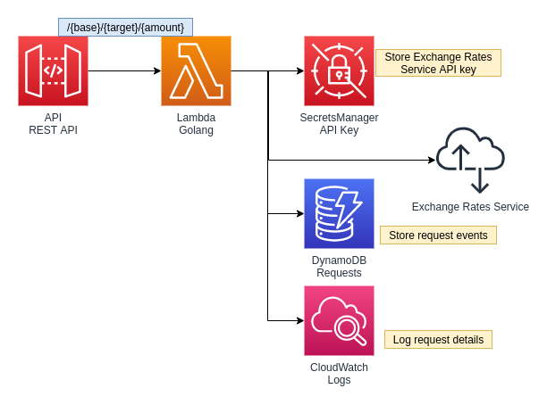

## Exchange
REST API created using API Gateway, AWS Lambda, and Golang

Exchange API proxies requests to convert currency values to a secondary foreign exchange rates api.

* Logs requests
* Request events saved in DynamoDB
* API protected with api keys
* API protected with usage plan throttling

